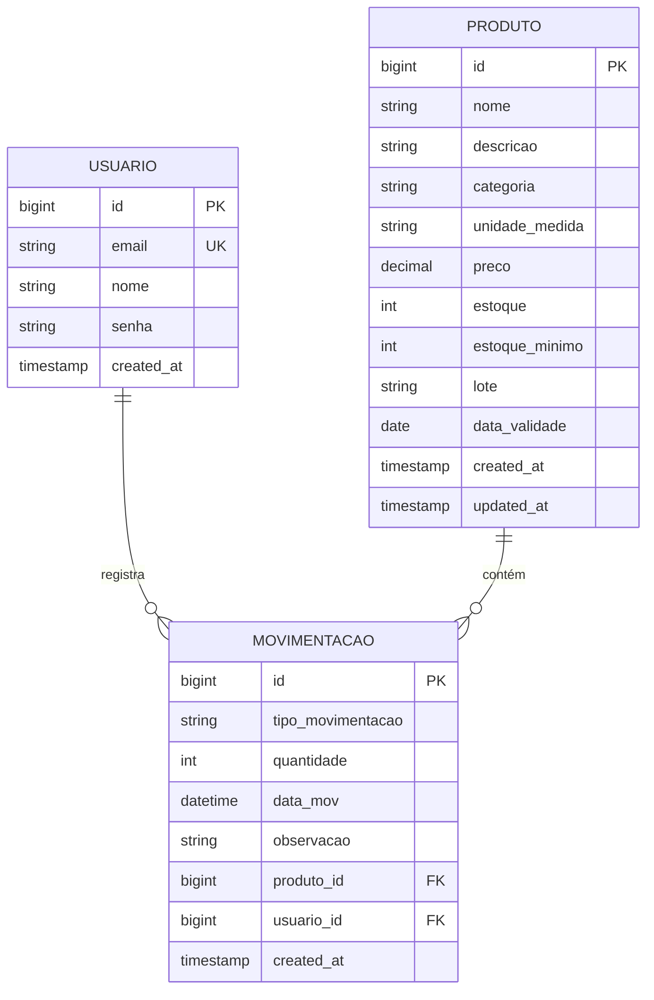
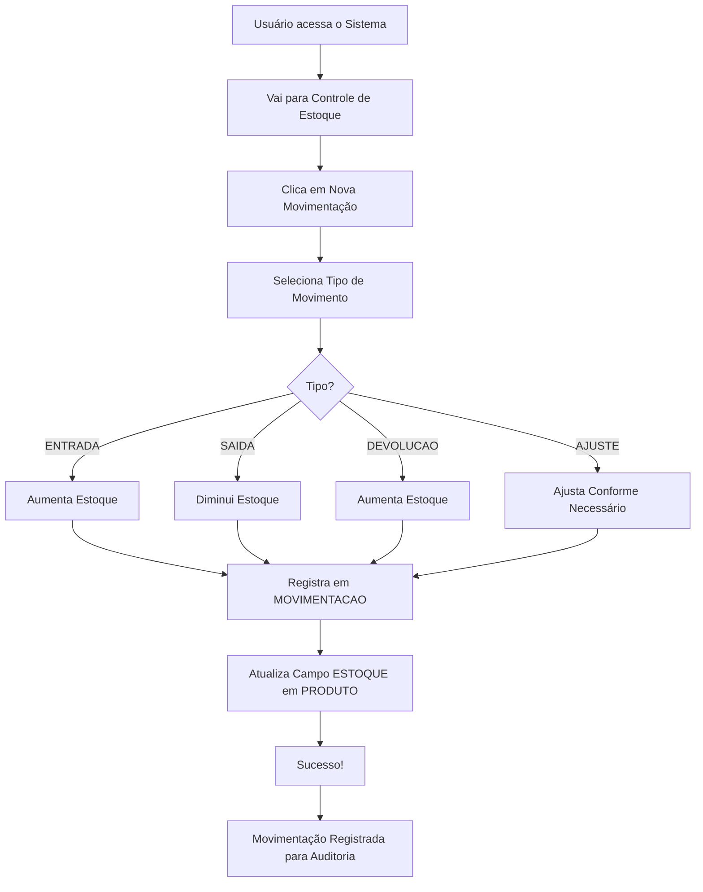
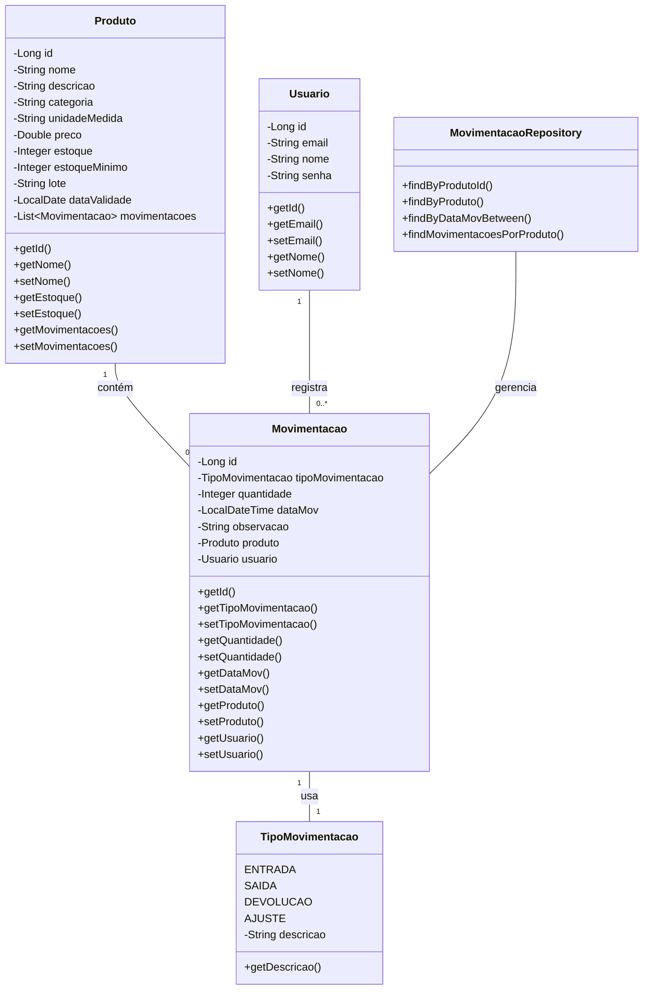
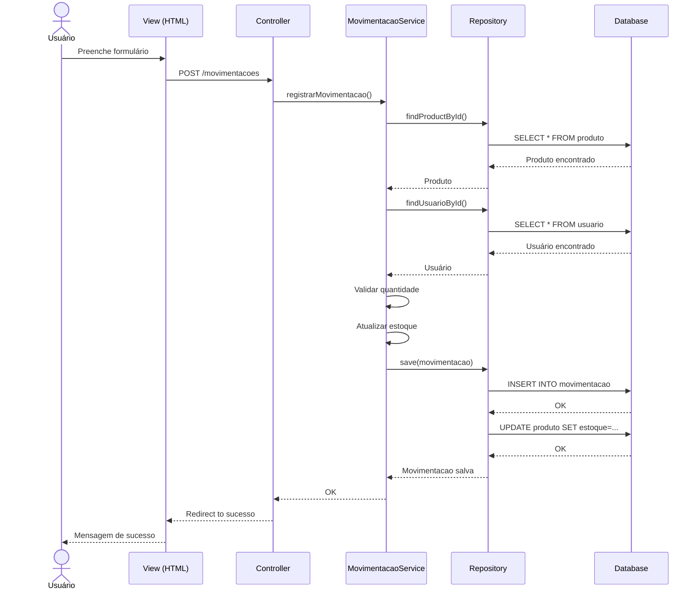
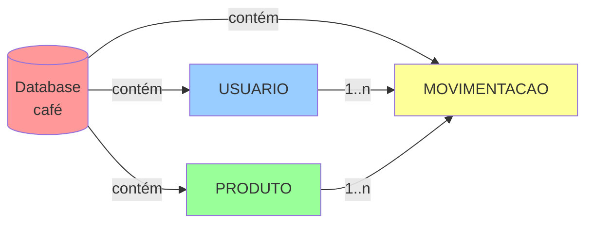
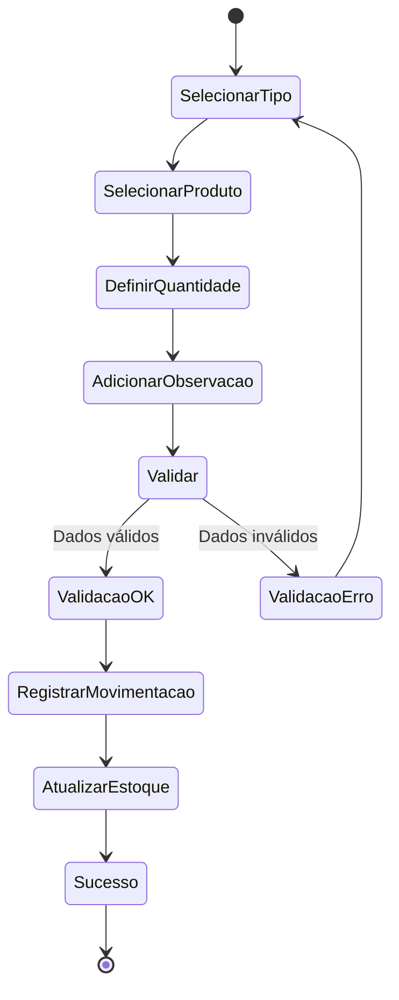
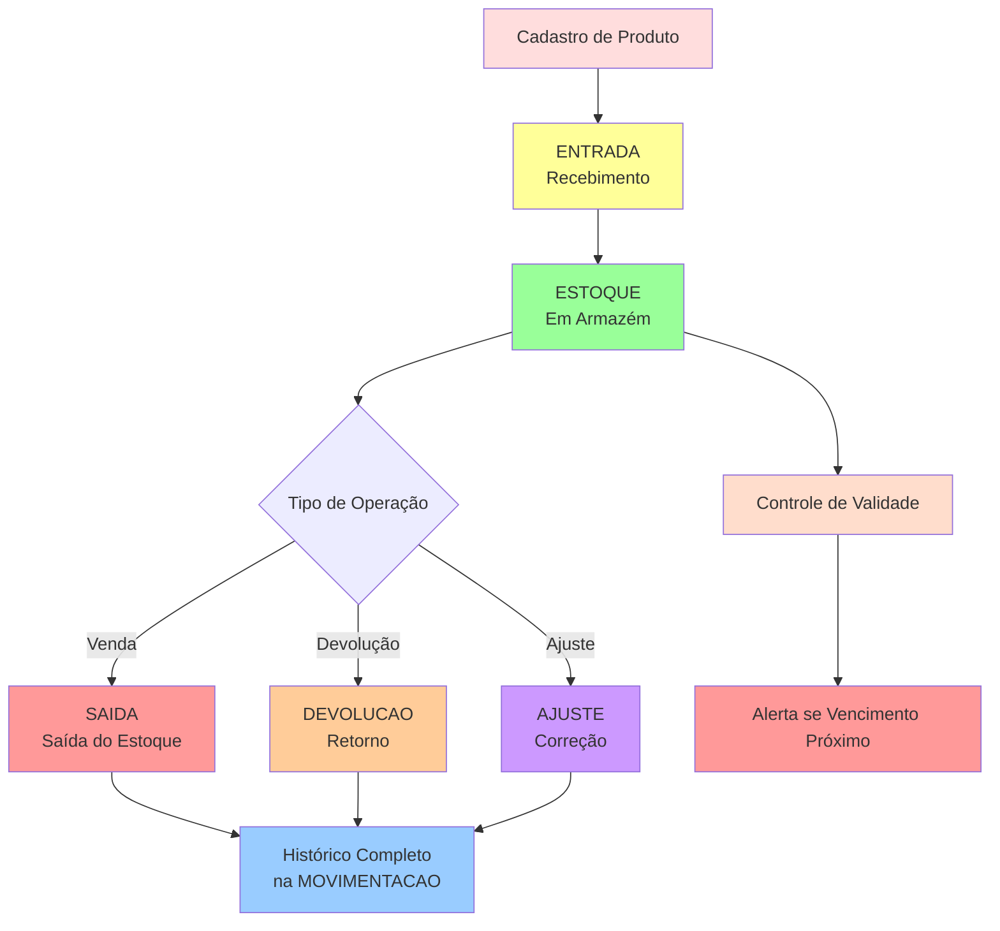
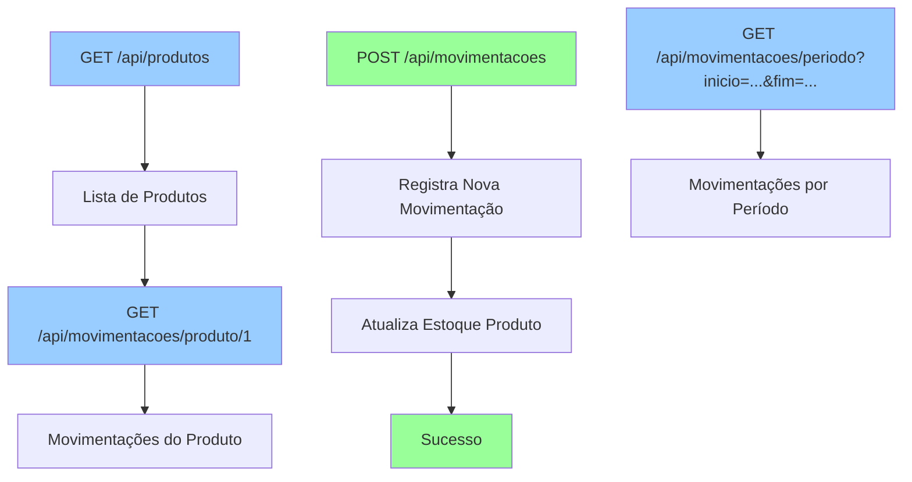

# DER em Formato Mermaid

## Diagrama ER

---

## Diagrama de Fluxo

---

## Diagrama de Classes

---

## Sequência: Registrar Movimentação

---

## Diagrama de Banco de Dados

---

## Estados de Movimentação

---

## Ciclo de Vida de um Produto

---

## Relacionamentos JSON (REST API)

---

Este documento utiliza a sintaxe Mermaid para criar diagramas. Você pode:

1. **Visualizar no GitHub** - Renderiza automaticamente
2. **Copiar para Notion** - Funciona em muitas plataformas
3. **Exportar como imagem** - Use mermaid.live

Para editar: https://mermaid.live

